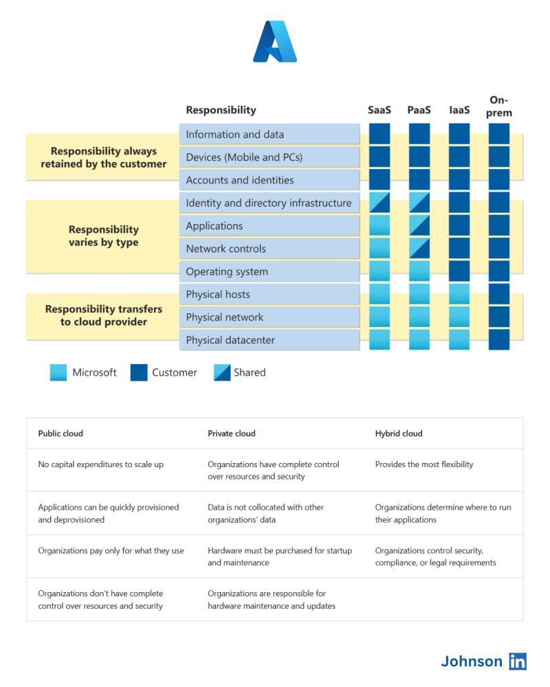
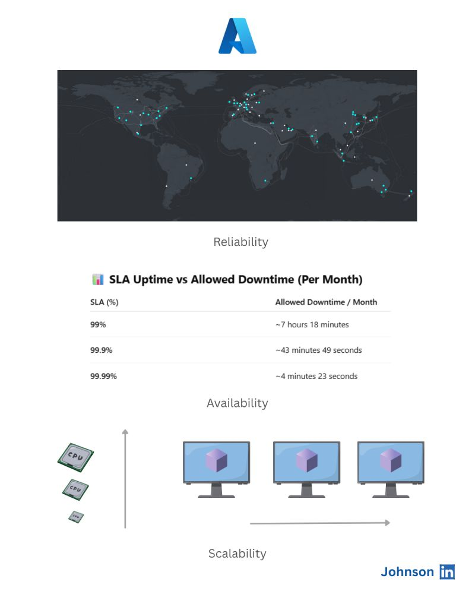

# Azure Fundamentals

This document outlines the essential concepts of Microsoft Azure.

---

## 1. Shared Responsibility Model

Cloud security and operations are a **shared responsibility** between the cloud provider and the customer.

### Customer Responsibilities

- **Data Management**  
  Responsible for protecting, backing up, and classifying your data.

- **Endpoint Device Security**  
  Ensure all user devices accessing cloud services are secure (e.g., OS updates, antivirus, VPN).

- **Identity and Access Management (IAM)**  
  - Control access to resources using tools like Azure Active Directory and RBAC.  
  - Enforce least privilege access.  
  - Monitor and audit access.

### Cloud Provider Responsibilities

- **Physical Infrastructure**  
  Management of data centers, networking, compute resources, storage, power, and cooling.

- **Hardware and Host Security**  
  Maintenance, patching, and physical security of the hardware.

- **Network Infrastructure**  
  Core networking, DDoS protection, routing, and data center interconnectivity.

---

## 2. Cloud Service Models

### Infrastructure as a Service (IaaS)

- Examples: Virtual Machines, Network Security Groups
- Customer manages: OS, runtime, apps, data
- Provider manages: Virtualization, servers, networking

### Platform as a Service (PaaS)

- Examples: Azure App Services, Azure SQL Database
- Customer manages: Apps and data
- Provider manages: Runtime, OS, infrastructure

### Software as a Service (SaaS)

- Examples: Microsoft 365, Dynamics 365
- Customer manages: Application configuration and usage
- Provider manages: Entire stack (app, runtime, OS, infrastructure)

---

## 3. Cloud Deployment Models

### i. Private Cloud

- Dedicated to one organization
- Hosted on-premises or by a third-party
- High security and control

### ii. Public Cloud

- Services available to the public
- Hosted and managed by providers like Azure, AWS, GCP
- Scalable, flexible, pay-as-you-go

### iii. Hybrid Cloud

- Combination of private and public cloud
- Enables data and application mobility
- Supports compliance, legacy systems, and sensitive workloads

### iv. Multi-Cloud

- Use of multiple cloud providers simultaneously
- Reduces vendor lock-in
- Enables resilience and optimized performance across platforms

---

## 4. Azure Arc

**Azure Arc** allows organizations to manage and govern on-premises, multi-cloud, and edge environments from Azure.

### Features

- **Resource Management**  
  Register non-Azure servers, Kubernetes clusters, and databases in Azure Resource Manager.

- **Policy & Security Enforcement**  
  Apply Azure Policies, RBAC, Defender for Cloud, and Monitor to all registered resources.

- **Supported Scenarios**  
  - On-prem servers (Windows/Linux)
  - Multi-cloud workloads (AWS, GCP)
  - Kubernetes clusters
  - SQL Server instances

---

### Responsibility Model and Cloud Deployment Models

---

### Benefits of using Azure

## Availability

Availability refers to the percentage of time a service is accessible and operational for users. This is defined by the Service Level Agreement (SLA) for each Azure service, which guarantees a certain uptime.

| SLA Uptime Percentage | Allowed Downtime per Month          |
|----------------------|-----------------------------------|
| 99% (two nines)      | Approximately 7 hours 18 minutes  |
| 99.9% (three nines)   | Approximately 43 minutes 49 seconds |
| 99.99% (four nines)   | Approximately 4 minutes 23 seconds |

---

## Reliability

Reliability is the ability of a service to recover and continue functioning after failures or disasters. Azure achieves reliability by distributing its infrastructure geographically. If one region experiences an outage, other regions can take over to minimize disruption.

---

## Scalability

Azure supports scaling in two ways to handle changing workload demands:

- **Vertical Scaling**  
  Increasing or decreasing the CPU, RAM, or other resources of an existing instance (scale up/down).

- **Horizontal Scaling**  
  Increasing or decreasing the number of instances or resources, such as virtual machines or containers (scale out/in).

---

## Predictability

Predictability involves anticipating and managing both performance and costs:

- **Performance Predictability**  
  Using autoscaling, load balancing, and high availability features to ensure resources are available when needed.

- **Cost Predictability**  
  Monitoring and controlling expenses in real-time with tools like Azure Cost Management.

---

## Real World
visit:

- https://lnkd.in/gniGze74  
- https://lnkd.in/gbqKVvjx

### benefits-of-using-azure

